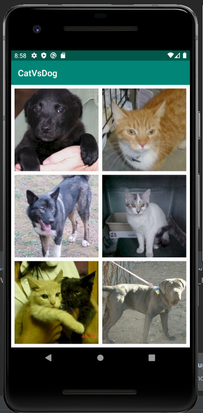
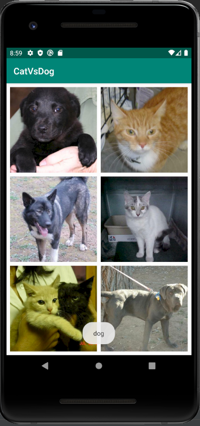

# Cat Vs Dog Tflite Version

## Application Architecture: 

View -> Preprocess Image -> TFLite Classifier -> Results

ImageClassifier activity file is responsible for retrieving images and displaying predicted category on screen.
Classifier file is responsible for preprocessing and do inferencing on it.


## Steps involved:

### Step 1: 
Initialize interpreter options. 
 - set numThreads
 - set useNNAPI
 - set AllowFp16PrecisionForFp32
 - add Delegate

Loading Models and labels.
 1. Get file descriptor 
 		``` val fileDescriptor = assetManager.openFd(modelPath) ```
 2. Open input stream
        ``` val inputStream = FileInputStream(fileDescriptor.fileDescriptor)```
 3. Read file channel
        ```
        val fileChannel = inputStream.channel
        val startOffset = fileDescriptor.startOffset
        val declaredLength = fileDescriptor.declaredLength
        ```
 4. load models
 		``` fileChannel.map(FileChannel.MapMode.READ_ONLY, startOffset, declaredLength)```
 5. set label
 		```lableList = loadLabelList(assetManager, labelPath)```
 6. Initialize interpreter
 		```Interpreter(loadModelFile(assetManager, modelPath), options)```

### Step 2:
Prepare Input - Cat and Dog

 1. Rescale and allocat buffer
 		```Bitmap.createScaledBitmap(bitmap, inputSize, inputSize, false)```
 2. Convert Bitmap to bytebuffer
 		```
 		val byteBuffer = ByteBuffer.allocateDirect(4 * inputSize * inputSize * pixelSize)
        byteBuffer.order(ByteOrder.nativeOrder())
        val intValues = IntArray(inputSize * inputSize)
        ```
 3. Get RGB channels of image
 		```
 		bitmap.getPixels(intValues, 0, bitmap.width, 0, 0, bitmap.width, bitmap.height)
        var pixel = 0
        for (i in 0 until inputSize) {
            for (j in 0 until inputSize) {
                val input = intValues[pixel++]
                byteBuffer.putFloat((((input.shr(16)  and 0xFF) - imageMean) / imageStd))
                byteBuffer.putFloat((((input.shr(8) and 0xFF) - imageMean) / imageStd))
                byteBuffer.putFloat((((input and 0xFF) - imageMean) / imageStd))
        ```

### Step 3: 
Running inference
		```
		val result = Array(1) { FloatArray(lableList.size) }
        interpreter.run(byteBuffer, result)
        ```

### Step 4: 
Gather results

 1. Initialize queue
 		```
 		val pq = PriorityQueue(
            maxResult,
            Comparator<Recognition> {
                    (_, _, confidence1), (_, _, confidence2)
                -> confidence1.compareTo(confidence2) * -1
            })
        ```
 2. List of labels stored
 		```
 		for (i in lableList.indices) {
            val confidence = labelProbArray[0][i]
            if (confidence >= threshHold) {
                pq.add(Recognition("" + i,
                    if (lableList.size > i) lableList[i] else "Unknown", confidence)
                )
            }
        }
        ```

## Sample Application

### Application UI: 


